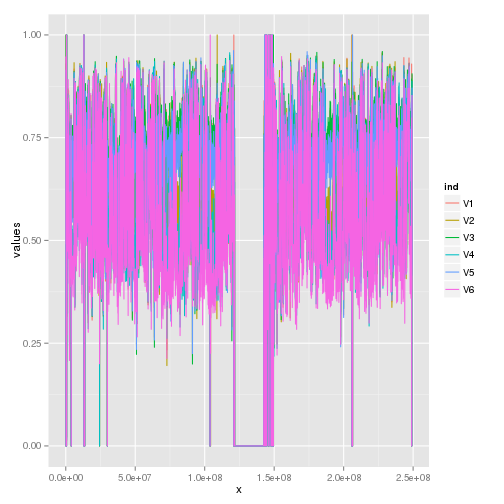

Whole Genome Bisulfite Sequencing
=================================

Overview
--------
This example demonstrates the use of our smoothing approach for improving the
signal-to-noise ratio for Whole Genome Bisulfite Sequencing (WGBS) methylation
data.

Analysis
--------
First let's load sample data and take a look at what we have:

```r
source("../smooth.r")
load(file = "../data/sample.rda")

# Methylation reads at each site
head(methylation)
```

```
##      [,1] [,2] [,3] [,4] [,5] [,6]
## [1,]    1    5    4    9    1    2
## [2,]    3    6    4    6    1    3
## [3,]    3    3    3    2    2    1
## [4,]    3    2    3    4    1    3
## [5,]    3    2    2    2    1    2
## [6,]    2    1    1    2    4    0
```

```r
summary(methylation)
```

```
##        V1              V2              V3              V4       
##  Min.   :    0   Min.   :    0   Min.   :    0   Min.   :    0  
##  1st Qu.:    1   1st Qu.:    1   1st Qu.:    2   1st Qu.:    1  
##  Median :    4   Median :    3   Median :    4   Median :    3  
##  Mean   :    4   Mean   :    3   Mean   :    4   Mean   :    4  
##  3rd Qu.:    6   3rd Qu.:    5   3rd Qu.:    6   3rd Qu.:    6  
##  Max.   :16306   Max.   :15501   Max.   :16506   Max.   :13777  
##        V5              V6       
##  Min.   :    0   Min.   :    0  
##  1st Qu.:    1   1st Qu.:    1  
##  Median :    3   Median :    2  
##  Mean   :    4   Mean   :    3  
##  3rd Qu.:    6   3rd Qu.:    5  
##  Max.   :13826   Max.   :14199
```

```r

# Total number of reads at each site
head(coverage)
```

```
##      [,1] [,2] [,3] [,4] [,5] [,6]
## [1,]    4    5    4    9    1    2
## [2,]    4    6    4    7    1    3
## [3,]    4    3    3    2    2    1
## [4,]    4    2    4    4    1    3
## [5,]    3    2    2    3    2    3
## [6,]    2    2    2    5    4    0
```

```r
summary(coverage)
```

```
##        V1              V2              V3              V4       
##  Min.   :    0   Min.   :    0   Min.   :    0   Min.   :    0  
##  1st Qu.:    3   1st Qu.:    3   1st Qu.:    3   1st Qu.:    3  
##  Median :    5   Median :    5   Median :    6   Median :    6  
##  Mean   :    6   Mean   :    5   Mean   :    6   Mean   :    6  
##  3rd Qu.:    8   3rd Qu.:    7   3rd Qu.:    8   3rd Qu.:    8  
##  Max.   :17793   Max.   :16594   Max.   :18090   Max.   :15064  
##        V5              V6       
##  Min.   :    0   Min.   :    0  
##  1st Qu.:    3   1st Qu.:    3  
##  Median :    5   Median :    5  
##  Mean   :    6   Mean   :    5  
##  3rd Qu.:    8   3rd Qu.:    7  
##  Max.   :15222   Max.   :16981
```

```r

# Methylation locations (offset in Chromosome)
head(cpgsites)
```

```
##       [,1]
## [1,] 10469
## [2,] 10471
## [3,] 10484
## [4,] 10489
## [5,] 10493
## [6,] 13079
```

```r
range(cpgsites)
```

```
## [1]     10469 249239887
```


Let's now apply our smoothing method and compare the results.

```r
result = fast.smooth(cpgsites, methylation, coverage)

# down-sampled data
head(result$small)
```

```
##        [,1]   [,2]   [,3]   [,4]   [,5]   [,6]
## [1,] 0.5964 0.5993 0.6385 0.5500 0.5796 0.5096
## [2,] 0.6630 0.6370 0.6821 0.5619 0.6482 0.5182
## [3,] 0.7008 0.6551 0.7071 0.5762 0.6875 0.5353
## [4,] 0.7008 0.6614 0.7082 0.6112 0.6889 0.5827
## [5,] 0.6925 0.6701 0.7006 0.6411 0.6835 0.6207
## [6,] 0.7033 0.6805 0.7096 0.6322 0.6918 0.6103
```

```r

# after interpolation back up to it's full size
head(result$y)
```

```
##        [,1]   [,2]   [,3]   [,4]   [,5]   [,6]
## [1,] 0.5967 0.5994 0.6387 0.5501 0.5799 0.5096
## [2,] 0.5967 0.5994 0.6387 0.5501 0.5799 0.5096
## [3,] 0.5967 0.5994 0.6387 0.5501 0.5799 0.5096
## [4,] 0.5967 0.5994 0.6387 0.5501 0.5799 0.5096
## [5,] 0.5967 0.5994 0.6387 0.5501 0.5799 0.5096
## [6,] 0.5968 0.5995 0.6387 0.5501 0.5800 0.5097
```


Finally, let's create some simple plots of our results.


```r
library(ggplot2)

# plot down-sampled data
dat = stack(as.data.frame(result$small))
scale_factor = (max(cpgsites) - min(cpgsites))/nrow(result$small)
dat$x <- rep(seq_len(nrow(result$small)), ncol(result$small)) * scale_factor
ggplot(dat, aes(x, values)) + geom_line(aes(colour = ind))
```

 

```r

# full-size
dat = stack(as.data.frame(result$y))
dat$x <- rep(seq_len(nrow(result$y)), ncol(result$y))
ggplot(dat, aes(x, values)) + geom_line(aes(colour = ind))
```

```
## Warning: Removed 126 rows containing missing values (geom_path).
```

 


Done!

